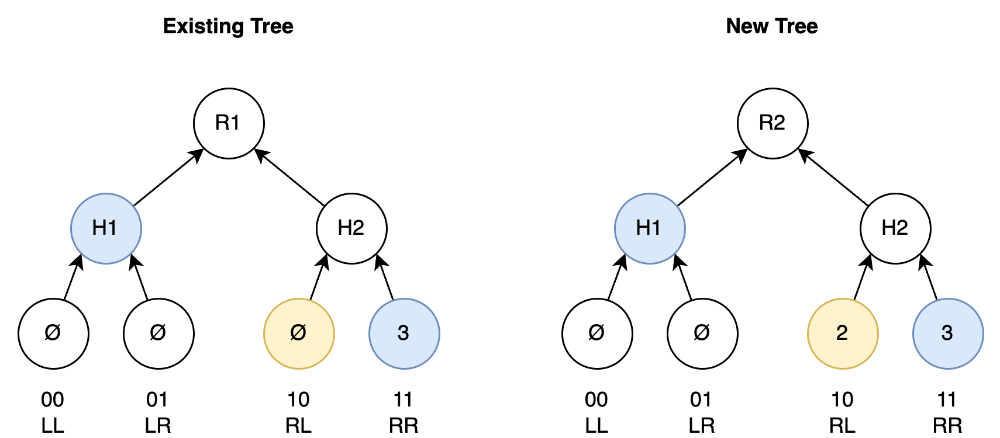
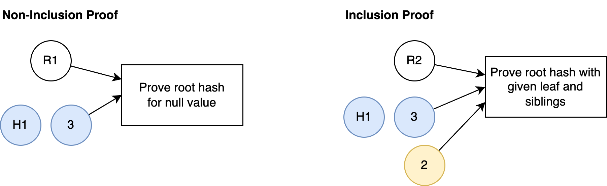
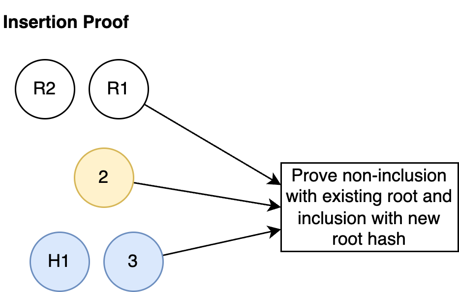

# Rollup

The rollup represents the entire state of the network, where each piece of state is referred to as a note, is represented by a commitment hash \[Merkle87]. Hashes result in data loss, so the original messages can provably never be reconstructed, improving the privacy of the protocol.

Each of the hash record states are stored in a merkle tree, so a single root hash can represent the entire state of the network. No underlying data is stored in the rollup, and therefore any required shared data must be stored in the Encrypted Transaction Registry. In addition to privacy, an additional advantage of storing only hashes in the rollup is that the rollup on disk data size can be somewhat constrained and deterministic. This is a result of all hashes being a consistent size regardless of the size of the underlying data. This reduction in the disk size requirements for clients, improves the number of clients able to join the network, thereby improving decentralisation.

The merkle tree must enable the following operations:

* Prove inclusion - prove a hash exists in the tree
* Prove non-inclusion - prove a hash does not exist in the tree
* Insert - insert a new hash into the tree if it does not already exist

To satisfy these properties, the Payy Network uses a sparse merkle tree \[DPP16]. A sparse merkle tree has a defined position for every possible value that can be inserted into the tree. In order to support a 256 bit (32 byte) hash, a tree of size $2^{256}$ is required. This means that for every operation, 256 tree nodes need to be traversed and validated. This may results in an unacceptable performance.

There are two possible optimisations to improve the performance:

1. A smaller tree could be used, such as $2^{128}$. This would result in a higher likelihood, but possibly still acceptable, risk of hash collision. For a tree of size $2^{128}$ it would take \~8 million years, generating 10,000 hashes per second to have a 1% chance of collision.
2. The tree can be sharded at multiple levels, allowing these verifications to occur in parallel

### Merkle Proofs

As every hash has a unique position in a sparse merkle tree, we can derive its position by decomposing each bit of the hash and traversing the tree based on whether the bit is 0 or 1. For 0, the tree is traversed to the left child, and for 1 the tree is traversed to the right child.

For an inclusion or non-inclusion proof, we can simply check that each of the provided siblings combined with the the computed child results in the root hash. For non-inclusion we are proving that the leaf node is a null value, which does not need to be passed to the proof, as it is a static value.

Insertion proofs are a combination of a non-inclusion proof (existing position must be null) and inclusion proof (proving the new root based on the inserted hash).

{ width=250px }
