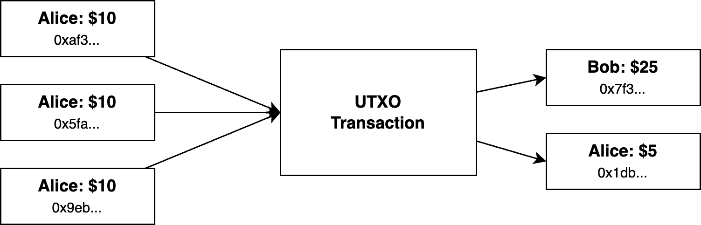
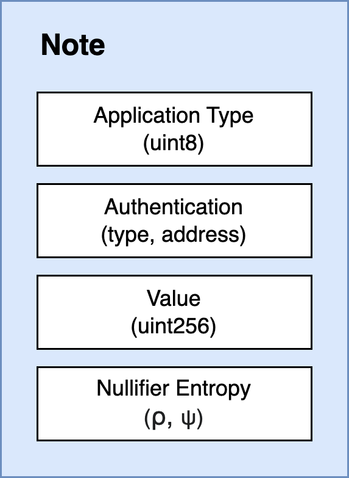

# UTXO

UTXO (Unspent Transaction Output) is a state model introduced by Bitcoin \[Nak08] and additionally used in Zcash \[GMRA13], and other blockchains to store the balances that can be spent. In this model, each store of value is a note that belongs to a specific authenticated account. Notes can be of any value, but can only be used once. If the note contains a value larger than you wish to transfer, you can create a new note with the output. You can use multiple input notes, so long as the total value of incoming notes is the same (or less) than the total value of outgoing notes.

This model has a number of advantages:

* **Scalability** - because a user can have multiple notes, multiple payments can be included in the same block (even in the case where the underlying data is hidden)
* **Privacy** - each transaction creates a new output record/hash. This prevents adversaries from looking for addresses with high activity or attempting to match accounts based on the source IP of the transaction, as is possible in account based models like Ethereum.

The considered drawbacks for the UTXO model are:

* **Increased tree depth** - UTXO transactions create one new insert hash for every incoming and outgoing note in a transaction. In contrast, an account based model (such as used in Ethereum) uses only a single hash insert per account, reducing the size of the tree.

Due to the strict privacy constraints desired for the Payy Network, the UTXO model was selected.

## Notes

Each note has the following state properties:

* **Application Type** - used to differentiate between different applications running on the Payy Network (each application type would have a different set of ZK circuit constraints)
* **Authentication** - used to verify which actor is allowed to “spend” a note
* **Value** - the balance of the note, balances between incoming and outgoing notes must match
* **Nullifier entropy** - additional nullifier entropy to increase security and privacy

{ width=150px }

## Authentication

Authentication identifies the user that is allowed to spend a note. The auth commitment is used in the Nullifer constraint to ensure that the user generating the nullifier (i.e. spending the note), knows the underlying secret key represented by the commitment. the Payy Network supports multiple authentication systems, denoted by a type enum, to provide flexible ownership over notes. Additional authentication types may be added over time.

### Poseidon

Users can generate a random 32-byte secret key, and use the poseidon commitment of the secret key as the authentication address for a note. This provides a highly performant authentication mechanism, but may not be well supported by existing wallets or tooling.

### Ethereum

The Payy Network natively supports Ethereum addresses. In this case, the auth commitment would be the Ethereum address. To spend with the Ethereum address a proof must be generated that proves ownership of the underlying private key. This can be achieved in zero knowledge by passing the Ethereum private key as a private input and and deriving the address from the private key.

## Minting and Burning

Special transaction types will allow the UTXO model to be modified in order to allow bridging of assets to and from the Payy Network:

* **Mint** - allows a note to be created without a corresponding input, minting will be further validated on Ethereum in the data availability layer before it will be accepted as a valid transaction
* **Burn** - allows a note to be used without a corresponding output, when this is proved on Ethereum, the funds will be released from the bridge contract

## Nullifier

As per the UTXO model, a note can only be used once. As such, the protocol must keep track of which notes have been used or spent, and which have not. Naively, this could be performed by removing used notes from the merkle tree, however this would reveal to a sender when a note they have sent to another user has been spent, reducing privacy.

Instead, to enhance privacy, we can use a deterministic nullifier record that for each spend must be inserted into the tree, and proven not to exist in the tree via a non-inclusion proof. The presence of the nullifier represents the record being spent. The nullifier is constructed in such a way that it is impossible for an external party to determine which nullifier matches a spent record (or a record to be spent).

The nullifier is calculated as follows:

$$
N = \text{Poseidon}(nk, \psi, cm)
$$

Where:

* $nk$ is the Nullifier Key, a unique secret associated with each user (this is a auth commitment to the auth)
* $\psi$ (psi) sender controlled randomness, additional entropy provided by Blake2b \[Aumasson et al. 2013] hash. Blake2b provides additional entropy and privacy security.
* $cm$ is the note commitment, which is a Poseidon commitment to the note.
