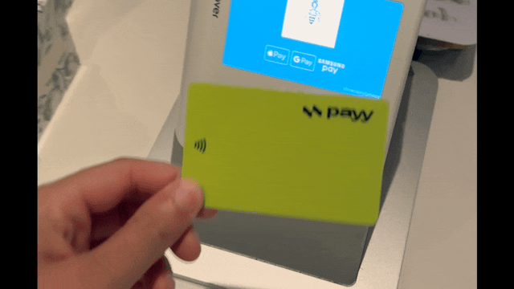

# Payy Card Launch

**August 6, 2025 — New York, USA**

Payy launches Payy Card, the first self-custodial Visa card that enables private, real-world stablecoin spending. With the passing of the GENIUS Act, stablecoin usage is now fully supported by the U.S. government, paving the way for retail and institutional adoption; however, most real-world use cases are not practical without some privacy guarantees.

Payy Card is that solution, utilizing zero knowledge cryptography to hide transaction amounts, so tap-to-pay spending does not broadcast holder balances to the world, all while remaining compliant.

“Stablecoins will fail without privacy. Consumers and businesses will not accept their transactions being analyzed and exploited,” said Sid Gandhi, CEO of Polybase Labs, the team behind the card. “Payy Card is the first time onchain crypto can be spent privately in the real world.”

“Payy finally built a real alternative to consumer banking. You can now save and spend self-custodied stablecoins privately without ever knowing they’re on a blockchain. And it just works,” said Robert Leshner, a Partner at Robot Ventures.

“This is just the start,” said Calum Moore, CTO of Polybase Labs. “We’ve been quietly building a stablecoin blockchain called Payy Network that powers Payy Wallet and Payy Card. Payy Network enables confidential and compliant stablecoin payments and access to integrated global fiat ramps. It will be available to developers later this year.”

In contrast to other crypto card offerings that introduce real-world risk through publicly-tracked onchain transactions, Payy Card uses ZK proofs on a custom built blockchain called Payy Network. These proofs create a decentralized, verifiable, compliant and safe payments network that ensures Payy can never expose holders' onchain payments or connect them to card spending.

When using tap-to-pay, the card’s logo illuminates, signaling a live blockchain transaction in progress. This is the first design of its kind.

Opening an account is as simple as downloading the Payy Wallet app. A card holder can then deposit to their wallet from multiple chains and tokens or bank accounts in select countries. Funds are fully controlled by the card holder so they can never be frozen or suspended.

Payy Card is now generally available through Payy Wallet. You can download Payy Wallet at [https://payy.link](https://payy.link/).

**About Payy and Polybase Labs**

Payy’s mission is to make money easy. Payy’s vision is to create an onchain bank for all of humanity.

Payy Wallet is a non-custodial blockchain wallet for storing and using stablecoins. Payy Network is a public blockchain for confidential and compliant stablecoin transactions. Payy Wallet and Payy Network are built by Polybase Labs as part of its mission to improve global equity through better blockchain infrastructure.

Polybase Labs was founded in 2022 by Sid Gandhi and Calum Moore out of their frustration with the lack of real world impact made by blockchain projects since the launch of Bitcoin in 2009. They have shipped products to millions of people at Apple and Virgin Media, contributed to multiple blockchain projects such as ZK Bench and Polybase DB as well as given talks at major crypto conferences (EthCC and ZK Summit).

Polybase Labs has raised funds from Robot Ventures, DBA Crypto, 6th Man Ventures, Orange DAO, Protocol Labs and others.

Learn more about Payy Wallet: [https://payy.link](https://payy.link/).

Learn more about Payy Network: [https://payy.network](https://payy.network/).

Learn more about Polybase Labs: [https://polybaselabs.com](https://polybaselabs.com/).

For questions, reach out to [hello@polybaselabs.com](mailto:hello@polybaselabs.com).
