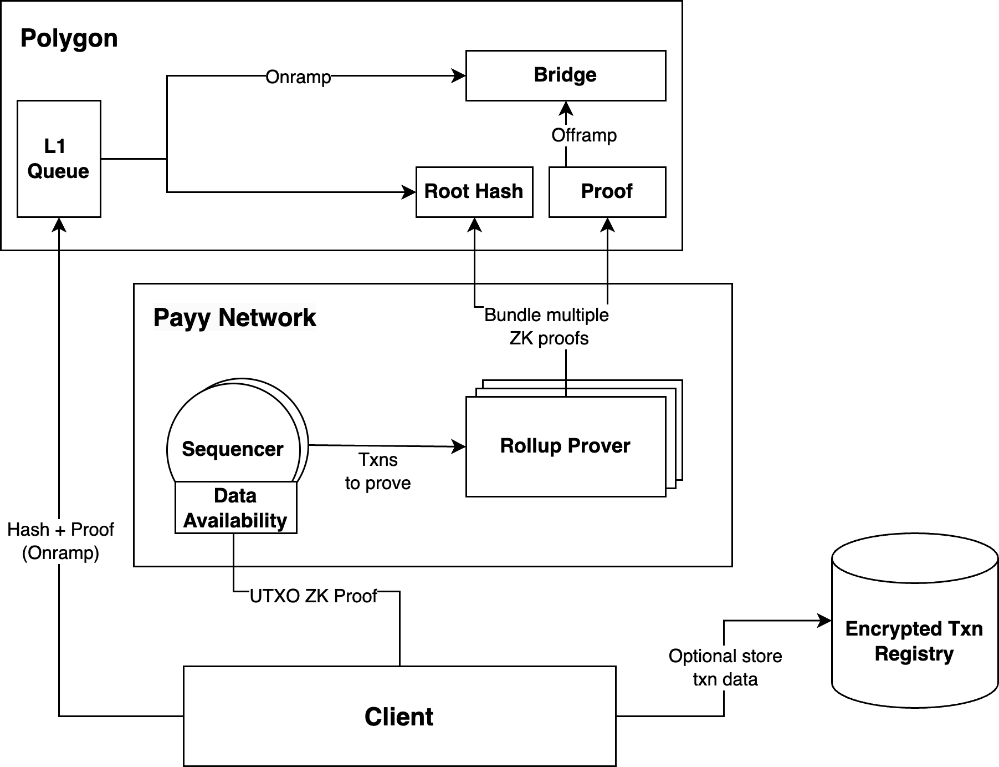

# Architecture

The Payy Network is an L2 Ethereum validium rollup with the following architecture:

## Roles

Each node on the the Payy Network protocol can perform one or more of the following distinct roles:

* **Sequencer** - sequences transactions into a block, guaranteeing the order of transactions and providing data availability
* **Prover** - prove in zero knowledge that an existing sequenced block is valid or invalid and submit proof to the L1
* **Client** - proves valid UTXO transactions, so transaction data can remain private
* **Encrypted Transaction Registry (Optional)** - stores transactions so that transactions can be made with offline users
* **Ethereum** - provides security for the network

The following sequence diagram demonstrates the flow of actors in the network during a transfer of notes.

## Sequencers

Sequencers are responsible for ordering transactions and validating transaction proofs. Sequencers form a Proof of Stake (PoS) network using the HotStuff consensus protocol \[AGM18]. This ensures that the sequencers can operate in a decentralised and censorship resistent form, enabling it to provide soft finality and data availability to the network.

Sequencers only need to store blocks since the last rollup (i.e. the last proven block on Ethereum), significantly reducing the overhead of running a sequencer. This dramatically increases the decentralisation of the protocol, as many commodity devices can participate in sequencing.

### Soft Finality

Sequencers provide fast (\~1s) soft finality for transactions through the PoS consensus. This security is only required for the short period between a transaction being sequenced into a block and that block being rolled up by the prover. This period of time is dependent on the number of provers and other network configuration. As such, a smaller stake can be used to secure the soft finality.

It is recommended that clients use soft finality for smaller transaction sizes. The determination for using soft finality would be based on the amount of stake, divided by the proving interval. For larger transactions, it is recommended that clients wait for full Ethereum finality (i.e. when the prover has rolled up the root hash to Ethereum). However, the responsibility for clearly communicating risk profiles for transaction sizes is delegated to the client.

### Data Availability

Availability of transaction data (UTXO proof and public input hashes) is essential, so all network participants can determine for themselves the full merkle tree (as the merkle tree algorithm is predictable). Without this, a prover could change the root hash on Ethereum without providing the txn data to other nodes, making it impossible for other nodes to know what the current state of the merkle tree is (only that it is valid). Without the current state of the merkle tree, no other nodes would be able to create a proof, as the merkle tree is used in proof generation.

## Provers

Provers prove that the L2 sequenced blocks are valid or invalid. If the block is valid, the proof and root merkle hash of the rollup is updated in Ethereum. The Ethereum smart contract needs only the proof and the new root hash from the prover to the verify and ensure the security of the network.

### Slot Allocation

It would be expensive and inefficient for all provers to submit proofs in parallel, as many of the proofs would be invalidated by a different recent proof included just before it. To prevent this, provers will be allocated slots which determine when they are eligible for submitting a sequencer of proof to Ethereum.

Ordering of slot allocation will based on a random deterministic ordering derived from a distributed randomness protocol, such as drand \[DLJ20]. Nodes are ranked for each L2 block, the primary node has priority for the first 8 blocks, then the next in line has priority for the next 8 blocks, and so on. Nodes can submit a block before the transaction deadline. If a prover fails to submit the block in a timely manor, other nodes can submit the block proof instead.

### Prover Rewards

To join as a prover, the prover is required to submit a small stake (e.g. 1ETH), designed to prevent nuisance behaviour. For example, provers could register but then fail to batch any transaction proofs on their allocated turn, or submit invalid proofs. There will be no limit to the number of sequencers that can join, improving the decentralisation of the network. Economic factors should limit the total number of provers to a reasonable level, as each additional prover reduces the overall gain for all other provers.

Provers are refunded for the cost of the Ethereum transaction to add the block, and also rewarded for their participation on the network.

### Block Frequency

The maximum frequency that sequencers should add transactions to Ethereum is 1 epoch (\~ 6 minutes), adding batches faster than this is redundant, as finality will not be improved due to reliance of the finality of Ethereum. The actual block frequency will be determined by the algorithm on the Ethereum smart contract, and will take into consideration the level of activity on the network, fees and other concerns.

## Ethereum

Ethereum provides the settlement layer for the Payy Network. It also holds the smart contracts required to administrate the network, for example, adding/removing sequencers and provers, slashing rules, and the bridge contracts.

### L1 Queue

The L1 Queue allows network participants to call other Ethereum smart contracts as part of any transaction that occurs on the Payy Network. Essentially, this allows for an atomic transactions across both Ethereum and the Payy Network. This is primarily used for the bridge functionality, so that funds can be locked on Ethereum via the bridge smart contract, whilst being simultaneously minted on the Payy Network, and vice versa. The L1 queue can also be used to better prevent censorship resistance, allowing any client to submit transactions directly and ensure they are included, albeit at a higher cost and slower transaction time.

L2 transactions pushed into the L1 Queue should be picked up by the next sequencer and included in the next batch/block. If no sequencer takes these transactions after a pre-determined period of time, then the transaction can be force included in its own block. This should be used only as an escape hatch.

### Bridge

The bridge smart contract on Ethereum is responsible for bridging assets from Ethereum to the Payy Network, and vice versa. Given the Payy Network does not currently provide smart contract functionality, a specific transaction is used for bridging assets. When this transaction type is used, the proof circuit would modify its rules (e.g. to allow new funds to be minted or burned, outside of the normal balanced txn rules).

#### Onboard: From Ethereum to the Payy Network

To use the bridge, a user would submit a single transaction to Ethereum directly, that both transfers the required funds to the Ethereum bridge contract, and adds the mint txn to the L1 Queue so the mint is propagated to the Payy Network. Before accepting a block from the prover, the smart contract would verify that the required funds were previously transferred.

#### Offboard: From the Payy Network to Ethereum

Withdrawing an asset from the Payy Network, involves proving that a UTXO note was burned, and no output on the Payy Network was derived. This would allow the Ethereum smart contract to release funds (previously locked during the Onboard process). This unlocking would occur once the L2 block has been proven, as this is the point the transactions are proven to be valid.

### Ethereum Reorgs

Finality on Ethereum takes 2 epochs and therefore within that time reorgs can occur. Reorgs could impact the the Payy Network sequencing and proving of transactions, but the worst case outcome would be that sequencers and provers would need to rework and submit their transactions. The state would never become invalid as a result of an Ethereum reorg.

## Encrypted Transaction Registry

The encrypted transaction registry is an optional protocol component that allows transactions to be sent to the receiver, while the receiver is offline. These transactions are stored encrypted with the receiver’s public key, ensuring only the receiver can decrypt the data. When a client joins the network, they scan the registry for new transactions that have been sent to them.
