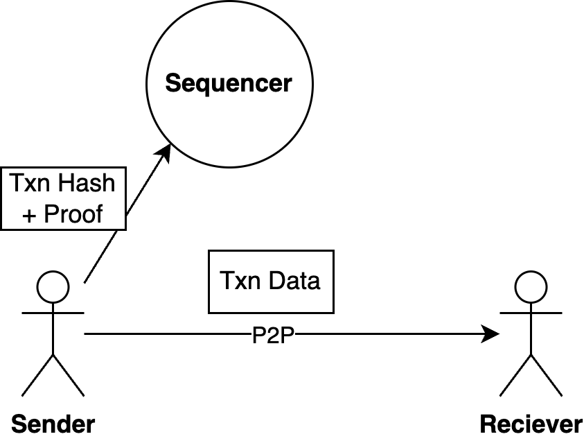
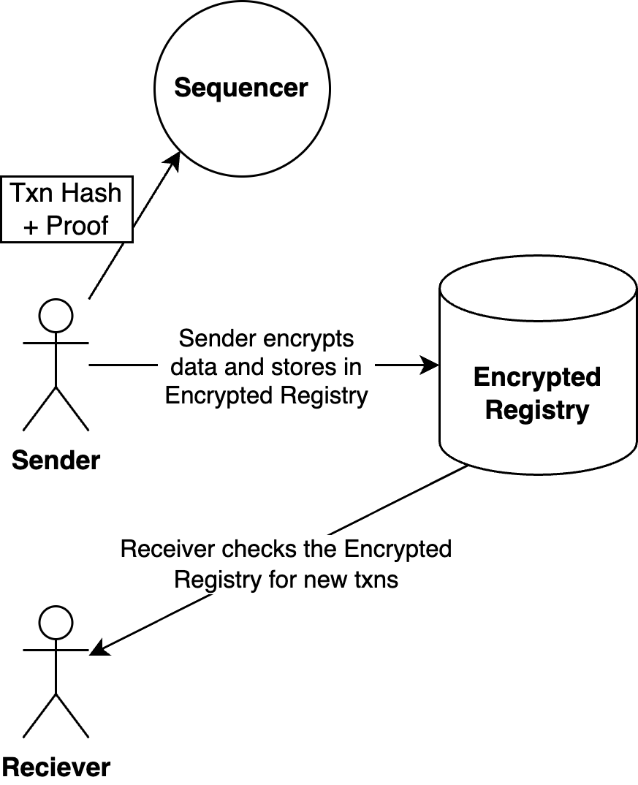

# Transmitting Notes

In order to spend a note you must have the data that represents the note being spent, as generating the spend UTXO proof requires the notes data; and only the hash commitment of the note is stored in the rollup. The sender of the note, is responsible for communicating the the new notes data to the receiver of the note. The sender could decide not send or record the output note, but then the receiver would not acknowledge receipt of note (i.e. from the senders perspective, they have not received any notes) and therefore it would be as if the transfer did not complete.

There are two mechanisms to allow senders to communicate the note data to the recipient.

* P2P - increased privacy, but requires both actors to be online
* Encrypted Registry - reduced privacy if encryption key is lost or exploited

## P2P

If both peers are online, the sender can send the transaction hashes and proofs to the sequencer, and the underlying data directly to the receiver. This method approach enhances privacy, as the underlying data is never stored in the public domain.

{ width=150px }

## Encrypted Registry

If the Sender and Receiver are not online at the same time, the transaction data can be stored in the Encrypted Registry. The Encrypted Registry is optional, and not a core part of the Payy Network protocol. It is provided purely as a convenience feature to store shared user transaction data.

To use the Encrypted Registry, the Sender uses the Receiver’s PublicKey to encrypt the data, so only the Receiver can decrypt it. When the Receiver joins the network, they can scan the Encrypted Registry attempting to decrypt all new records since they were last online. If they are able to decrypt a transaction, then it is a transaction they have been sent.

{ width=150px }

Users of the Encrypted Registry should be aware that using it reduces the level of privacy protection. If the data is encrypted in a public registry there are two main risks:

1. Exposed secret key - secret key used for encryption is compromised at any point in time
2. Compromised encryption protocol - underlying encryption protocol is broken by advances in cryptography or compute

As the Encrypted Registry is an optional feature, other providers could offer alternative encrypted registries to store transactions. In future, we may provide a sharded decentralised encrypted registry, where the encrypted data is split into chunks and blindly stored across multiple nodes, reducing the exposure to the risks described above.
