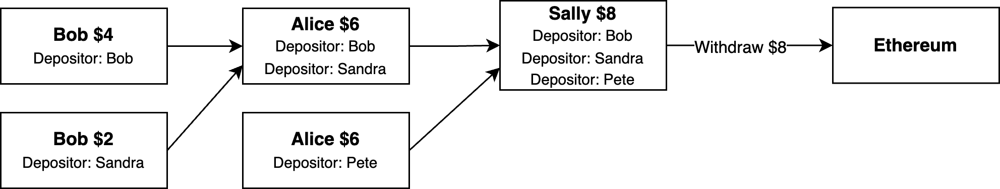
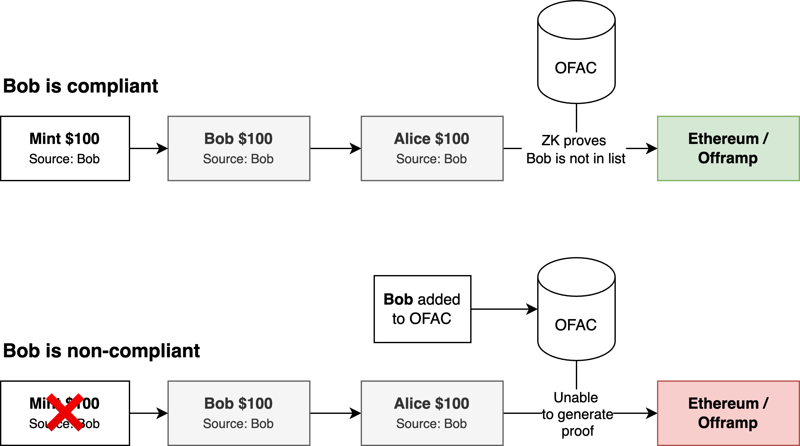

# Compliance

Public blockchains allow regulators to easily verify on chain activity is compliant with regulations. As the Payy Network is privacy preserving, compliance capabilities need to be defined at the protocol level to ensure the network is not useful to those seeking to perform illicit activity.

There are a number of different mechanisms for enforcing compliance on the network:

1. Transaction lineage - tracking of full or partial transaction lineage, so that illicit funds can be tracked and disabled across the network. Transaction details are still private.
2. Privacy pools - bundling transactions and actors into pools of good and or bad actors and treating them as a single entity
3. Compliance ZK proofs - enable us to hide information while proving specific compliance constraints

These techniques could be used independently or in combination to ensure the required level of compliance. In addition, these capabilities could be applied at either onramp/offramp or for each individual transaction depending on the regulatory or user requirements.

## Transaction lineage

Transaction lineage allows the network to trace the source of funds (but not individual transaction details) across the network. This can generally be split into two categories:

1. **Source lineage** - source tracking tracks only the source of each transaction as it enters and exists the network. This enables onramp and offramp providers to reject transactions that are from external sources which are later found to be illicit.
2. **Full lineage** - all transaction lineage can be tracked. This reduces the level of privacy, as any new holder of the note obtains a significant portion of lineage, and could reveal this publicly without consent of the other parties.

The transaction lineage would be added to each note, so any receiver of a note would obtain the transaction lineage, but outside parties would not. In order to avoid exponentially increasing note size, the lineage of transactions would only be maintained for a specified time period (i.e. number of blocks, where block time is constant), for example 1 year.

## Privacy Pools

Privacy pools \[BJMFA23] is a mechanism that group users into pools that share the same level of regulatory and compliance risk. Although the focus of the privacy pools paper is based around the use of privacy pools in so called “mixers”, it does discuss the implications of extending this to a system where intermediate transfers are possible.

Extending this to such a system requires users to accept the risk of loss of funds if a particular pool they are part of is deemed to be non-compliant. It would therefore be essential that users choose a pool which matches their risk appetite.

There are a number of different types of pools that could used, such as:

* Add with delay, exclude bad actors
* KYC pool
* N per month per person
* N per month per trusted community member
* Real-time AI-based scoring

Transactions between pools would be allowed according to the inbound/outbound rules of both pools.

## Compliance ZK-Proofs

ZK proofs enable us to prove certain attributes of a transaction or chain of transactions in a privacy preserving environment. These proofs could be used as a layer on top of privacy pools or transaction lineage to provide additional privacy while maintaining the same level of compliance.

In addition, ZK could be used to prove/enforce additional constraints. Offramp providers could even enforce their own additional ZK constraints. These additional constraints can be applied by the offramp in a permission-less manner outside of the protocol, as the proofs would be generated locally on the client and submitted in addition to the protocol proof to the offramp.
