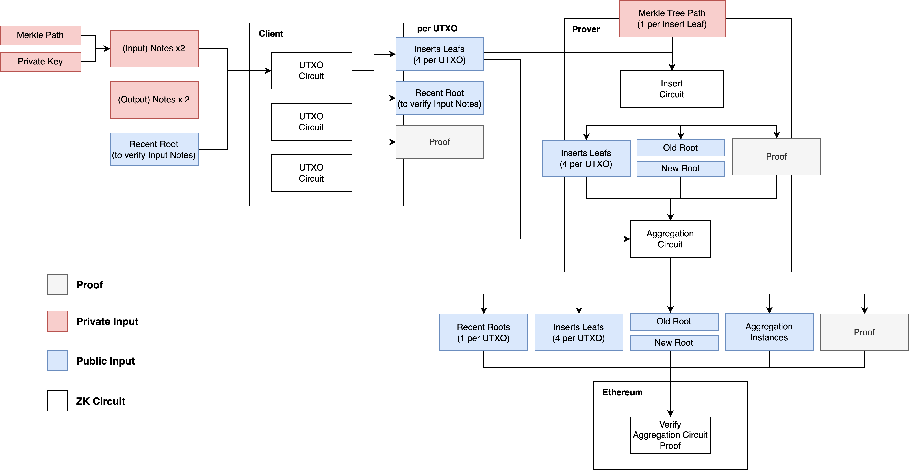

# ZK Proofs

There are three ZK circuits required for the the Payy Network ZK rollup:

1. **UTXO proof (client)** - runs on the client and proves that a user has permission to spend an input note and generate an output note
2. **Insert proof (prover)** - calculates the new root given a number of UTXO proofs
3. **Aggregation proof (prover)** - combines multiple UTXO proofs and the insert proof into a single proof to be verified on Ethereum

In addition, a compliance proof can optionally be generated at any time to prove compliance of given notes:

1. **Compliance proof (client)** - allows the client to prove that the source of their funds is not from a blacklisted address

The following diagram represents the high level of flow of input constrains to the zero knowledge circuits.

## Proof Algorithm

There has been rapid improvements in zk-SNARK/zk-STARK algorithms in recent years. Groth-16 \[Gro16] has been traditionally the benchmark, which is used in large scale decentralised protocols, such as Filecoin \[BPZZ17]. However, this algorithm relies on a trusted setup procedure which makes updating the protocol difficult, and prevents the use of user generated functions (i.e. smart contracts), so it will not be used in the Payy Network.

Instead, the Payy Network uses Halo2 circuits with a HyperPlonk \[CBZZ22] arithmetisation scheme and KZG \[KZG10] as the polynomial commitment scheme. In addition to the performance characteristics, Halo2 was selected for its high security guarantees having been audited and used in production for numerous projects such as Zcash \[Hopwood et al. 2022] and Scroll.

The KZG commitment scheme was selected over the IPA \[BBBF18] commitment scheme, for the improved performance, especially in relation to aggregation proofs. Further enhancements to the proving system are anticipated. For example, improved recursion techniques, such as ProtoStar \[BC23], could likely yield significant performance increases.

The BN256 pairing friendly elliptic curve \[BN06] is used over the pasta curves traditionally used with Halo2, due for the need of verifying the proofs on Ethereum.

## Performance

Performance is a key consideration for zero knowledge circuits, in particular the prover cost is significant compared to running computation in a native turing machine. The following outlines the expected performance characteristics of each proof.

| Circuit           | Browser | Desktop/Mobile | Optimised Server |
| ----------------- | ------- | -------------- | ---------------- |
| UTXO Proof        | 9s      | 3s             | -                |
| Insert Proof      | N/A     | N/A            | < 1s             |
| Aggregation Proof | N/A     | N/A            | 40s              |
| Compliance Proof  | 1s      | 0.3s           | -                |

## Enhanced throughput with multi-level aggregations

To increase the throughput of the network, multiple levels of aggregation can be applied, which can then recursively combine multiple proofs into a single proof. Each additional level of proof increases the overall throughput of the network, at the expense of additional latency.

| Aggregators                | Layers | TPS    | Latency |
| -------------------------- | ------ | ------ | ------- |
| 1                          | 1      | 10     | 10s     |
| 11 (10 + 1)                | 2      | 100    | 20s     |
| 111 (100 + 10 + 1)         | 3      | 1,000  | 30s     |
| 1111 (1000 + 100 + 10 + 1) | 4      | 10,000 | 40s     |
